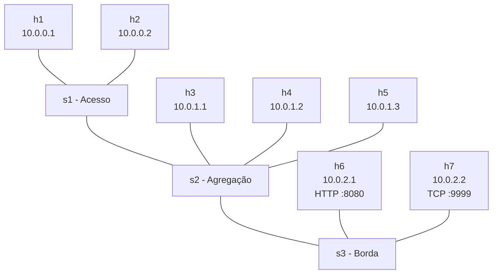

# Lab de Rede Corporativa — Mininet + Docker

Laboratório de redes que simula uma rede corporativa segmentada com **Mininet** e, em paralelo, um ambiente de serviços em contêineres **Docker**, para praticar endereçamento IP, segmentação, switching e análise de tráfego.


---

## Visão geral

O projeto tem duas partes independentes:

| Parte | Arquivo | O que faz |
|---|---|---|
| Rede simulada | `topologia_mininet.py` | Cria 3 switches Open vSwitch em hierarquia e 7 hosts distribuídos em 3 segmentos de rede, com banda e latência configuradas por link |
| Serviços em contêiner | `docker-compose.yml` | Sobe um servidor web, um Redis e um contêiner de monitoramento com tcpdump numa rede bridge dedicada |

## Topologia Mininet



| Segmento | Sub-rede | Hosts | Switch | Link |
|---|---|---|---|---|
| Administração | 10.0.0.0/24 | h1, h2 | s1 | 100 Mbps, 1 ms |
| Usuários | 10.0.1.0/24 | h3, h4, h5 | s2 | 100 Mbps, 2 ms |
| Servidores | 10.0.2.0/24 | h6, h7 | s3 | 1 Gbps, 0,5 ms |

Ao iniciar, o script também:
- configura em cada host rotas estáticas para os outros segmentos, via gateway `.254` de cada sub-rede;
- sobe um servidor HTTP em `h6` (porta 8080) e um listener TCP com netcat em `h7` (porta 9999);
- mostra conexões, IPs e MACs de todos os hosts e abre o CLI do Mininet.

## Ambiente Docker

Rede bridge `corp_network` na sub-rede `172.18.0.0/16` (gateway `172.18.0.1`):

| Serviço | Imagem | Porta | Função |
|---|---|---|---|
| `web` | Ubuntu 22.04 + Python | 8000 | Servidor HTTP com os endpoints `/`, `/info` e `/health` |
| `database` | Redis 7 (Alpine) | 6379 | Banco em memória com configuração própria (`redis.conf`) |
| `monitor` | Ubuntu 22.04 | — | Contêiner com `tcpdump`, `ping` e `net-tools` para capturar tráfego da rede |

Todos os serviços têm health check e limite de tamanho de log.

## Estrutura

```
lab-mininet-docker-networking/
├── topologia_mininet.py     # Topologia, rotas e serviços do Mininet
├── docker-compose.yml       # Serviços e rede Docker
└── dockerfiles/
    ├── Dockerfile.web       # Servidor web em Python
    ├── Dockerfile.db        # Redis
    └── redis.conf           # Configuração do Redis
```

## Requisitos

- Linux (testado em Ubuntu 20.04 ou superior)
- Mininet 2.3+ e Open vSwitch
- Docker e Docker Compose
- Python 3.8+
- `iperf`, `tcpdump` e Wireshark (opcionais, para testes e análise)

```bash
sudo apt install mininet docker.io docker-compose iperf tcpdump -y
```

## Como executar

**1. Rede Mininet**

```bash
git clone https://github.com/Heitormeira/lab-mininet-docker-networking.git
cd lab-mininet-docker-networking
sudo python3 topologia_mininet.py
```

Testes no CLI do Mininet:

```bash
mininet> pingall              # conectividade geral
mininet> h1 ping -c 3 h2      # dentro do segmento Administração
mininet> h3 ping -c 3 h5      # dentro do segmento Usuários
mininet> h7 iperf -s &        # servidor iperf no segmento Servidores
mininet> h6 iperf -c h7 -t 5  # throughput no link de 1 Gbps
mininet> h1 ip route          # rotas configuradas
```

**2. Serviços Docker** (em outro terminal)

```bash
docker-compose up -d --build
docker ps
curl http://localhost:8000/health
curl http://localhost:8000/info
```

**3. Captura de tráfego**

```bash
sudo tcpdump -i s1-eth1 -w captura.pcap   # interface de um switch do Mininet
wireshark captura.pcap
```

## Limitações conhecidas e próximos passos

- **Roteamento entre segmentos:** os hosts apontam para gateways `10.0.x.254`, mas a topologia ainda não tem um roteador com esses endereços. Por isso, a comunicação funciona dentro de cada segmento, mas não entre segmentos diferentes. O próximo passo é adicionar um host roteador Linux com `ip_forward` habilitado.
- **Integração Mininet ↔ Docker:** hoje os dois ambientes rodam lado a lado, sem link direto entre eles. A integração pode ser feita com [Containernet](https://containernet.github.io/) ou ligando a bridge do Docker a um switch OVS.
- Separar os segmentos em VLANs no Open vSwitch.

## Conceitos praticados

Endereçamento IPv4 e sub-redes · switching com Open vSwitch · topologia hierárquica (acesso, agregação e borda) · rotas estáticas · controle de banda e latência com `TCLink` · redes bridge no Docker · health checks · captura de pacotes com tcpdump e Wireshark

## Autor

**Heitor Meira**, estudante de Ciência da Computação na UNICAP
[LinkedIn](https://linkedin.com/in/heitormeira) · [GitHub](https://github.com/Heitormeira)

## Licença

Distribuído sob a licença MIT. Veja [LICENSE](LICENSE).
